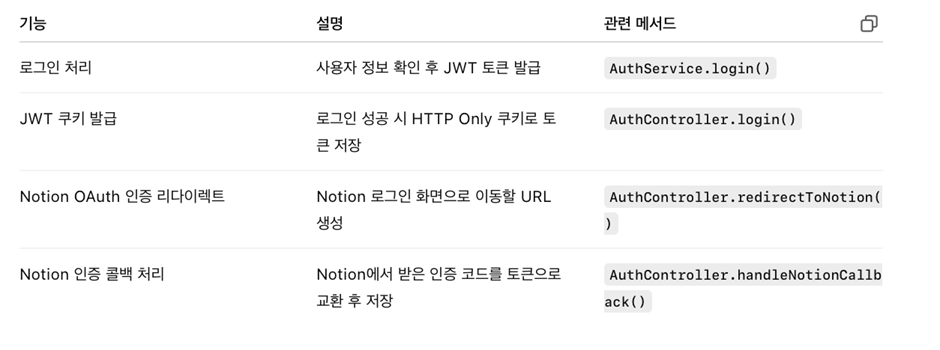
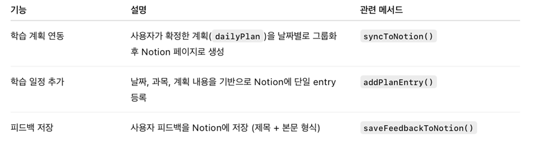

## 📁 프로젝트 구조 및 주요 파일 설명
```plaintext
advanced-programming
├── auto-planner-backend/
│   ├── prisma/
│   │   └── schema.prisma                 # DB 구조 정의
│   ├── src/
│   │   ├── auth/ # 인증, 로그인 및 Notion OAuth 연동 처리
│   │   │   └── auth.controller.ts        # 인증 관련 라우팅
│   │   │   └── notion-token.store.ts     # 사용자별 Notion 토큰을 메모리에 저장
│   │   │   └── jwt-auth.guard.ts     # 인증이 필요한 라우트에 적용되는 Guard &
Passport의 jwt 전략을 사용해 인증을 처리

│   │   ├── exam/
│   │   │   └── dto/ # 시험정보, 챕터요청/응답형식
│   │   │   └── exam.controller.ts        # 시험정보의 등록, 조회, 삭제 API 엔드포인트
│   │   │   └── exam.module.ts         # 서비스와 컨트롤러 등록, 다른 모듈에서도 사용하도록 내보냄
│   │   │   └── exam.service.ts        # 시험 관련 로직 처리 및 DB와 통신
│   │   ├── notion/ # 학습 계획을 notion과 연동하는 기능 모듈
│   │   │   └── notion.controller.ts      # /notion/sync 엔드포인트를 통해 사용자의 계획을 Notion에 연동
│   │   │   └── notion.service.ts         # OAuth 토큰 기반 Notion 클라이언트 생성 & 계획 한 건 생성 & 전체 계획 그룹화 및 반복 생성, 피드백 저장기능
│   │   ├── planner/
│   │   │   └── ai/
│   │   │       ├── server/
│   │   │       │   └── llm-client.service.ts   # LLM 서버 API 호출 클라이언트
│   │   │       ├── utils/
│   │   │       │   ├── date-utils.ts     # 날짜 슬라이싱, valid 날짜 계산 등
│   │   │       │   └── json-utils.ts     # LLM 응답에서 JSON 추출
│   │   │       ├── ai-planner.controller.ts    # /ai-plan/generate API 처리
│   │   │       ├── ai-planner.service.ts       # 학습 계획 생성 비즈니스 로직
│   │   │       ├── generate-plan.dto.ts        # 학습 계획 생성 DTO (입력 형식)
│   │   │   └── dto/
│   │   │       ├── confirm-plan.dto.ts # 학습 계획 관련 요청/응답 DTO 정의
│   │   ├── prisma/
│   │   │   └── prisma.service.ts         # prisma client를 초기화하고 앱 전체에서 가능하게함(NestJS에서 prisma client 사용 위해 in src)
│   │   ├── user/ # 사용자 정보 관리
│   │   │   └── user.controller.ts        # RESTful API의 라우팅을 담당
│   │   │   └── user.service.ts        # 사용자 생성 및 조회 로직을 담당 & PrismaService를 통해 DB와 직접 통신
│   │   ├── user-preference/
│   │   │   └── dto/   # 사용자의 학습 스타일, 학습 요일, 하루 세션 수를 정의, swagger 문서화 지원
│   │   │   └── user-preference.controller.ts   # 사용자의 학습 선호도 정보를 저장하고 조회하는 API 엔드포인트 정의
│   │   │   └── user-preference.module.ts    # 선호도 담당하는 서비스와 컨트롤러 등록하고 다른모듈에서 사용하도록 내보냄
│   │   │   └── user-preference.service.ts    # 선호도 정보 저장, 조회 로직 처리하고 DB와 통신
│   │   ├── .env #데이터베이스 접속 정보와 JWT키 설정 값을 환경변수로 관리

├── frontend/                                   # 프론트엔드 루트 디렉토리
│   ├── src/                                    # 소스 코드 루트
│   │   ├── lib/                                # 공통 라이브러리 및 유틸리티
│   │   │   └── api/                            # 백엔드 API 연동 모듈
│   │   │       ├── ai-planner.ts               # AI 학습 계획 관련 API 함수
│   │   │       ├── auth.ts                     # 인증/로그인 관련 API 함수
│   │   │       ├── confirm.ts                  # 계획 확정 관련 API 함수
│   │   │       ├── exam.ts                     # 시험 정보 관련 API 함수
│   │   │       ├── notion.ts                   # Notion 연동 관련 API 함수
│   │   │       ├── user.ts                     # 사용자 정보 관련 API 함수
│   │   │       ├── userPreference.ts           # 사용자 선호도 관련 API 함수

│   │   │   └── components/                     # Svelte UI 컴포넌트 모음
│   │   │       ├── Header.svelte               # 상단 헤더 컴포넌트
│   │   │       ├── MainSection.svelte          # 메인 섹션(메인 화면) 컴포넌트
│   │   │       ├── MyinfoCard.svelte           # 내 정보 카드 컴포넌트
│   │   │       ├── NotionLink.svelte           # Notion 연동 버튼/링크 컴포넌트
│   │   │       ├── PlanCard.svelte             # 학습 계획 카드 컴포넌트
│   │   │       ├── SettingsConfirmationPage.svelte # 설정 확인 페이지 컴포넌트
│   │   │       ├── SettingsSummary.svelte      # 설정 요약 컴포넌트
│   │   │       ├── SubjectForm.svelte          # 과목 입력 폼 컴포넌트
│   │   │       ├── SubjectPlannerPage.svelte   # 과목별 학습 계획 페이지
│   │   │       ├── Welcome.svelte              # 환영/인트로 화면 컴포넌트

│   │   │   └── stores/                         # Svelte 상태 관리(store) 모듈
│   │   │       ├── user.ts                     # 사용자 상태 관리 store

│   │   ├── routes/                             # SvelteKit 라우트(페이지) 폴더
│   │   │   └── exam/                           # 시험 관련 페이지 라우트
│   │   │       ├── +page.svelte                # 시험 메인 페이지
│   │   │   └── main/                           # 메인 대시보드 페이지 라우트
│   │   │       ├── +page.svelte                # 메인 대시보드 페이지
│   │   │   └── signup/                         # 회원가입 관련 라우트
│   │   │       ├── +page.svelte                # 회원가입 메인 페이지
│   │   │   └── userinfo/                       # 회원정보 입력 라우트
│   │   │       ├── +page.svelte                # 회원정보 입력 페이지
│   │   │   └── userpreference/                 # 사용자 선호도 입력 라우트
│   │   │       ├── +page.svelte                # 선호도 입력 페이지
│   │   │   └── +layout.svelte                  # 레이아웃
│   │   │   └── +page.svelte                    # 로그인 페이지
```

## 📁 파일에 대한 각 세부 설명
```
backend
📁auth :사용자 인증 전반을 담당하며, JWT 기반 로그인 및 토큰 발급, 쿠키 저장, Notion OAuth 연동 기능을 제공합니다. 또한, 사용자별 Notion 토큰을 임시 메모리(Map)에 저장하고, 이후 Notion API 연동 시 활용합니다.

세부기능설명
🔹 auth.controller.ts
/auth/login
→ 사용자 로그인 요청 처리, JWT 토큰 발급 후 access_token을 쿠키에 저장
/auth/notion/redirect
→ Notion 인증 화면으로 리다이렉트할 URL 생성
/auth/notion/callback
→ Notion에서 전달받은 code로 토큰 요청, 사용자 ID에 매핑하여 저장

🔹 auth.service.ts
사용자의 비밀번호를 검증 후 JWT 토큰 발급 (validateUser)
로그인 시 userId가 payload에 포함된 토큰 생성

🔹 notion-token.store.ts
사용자별 Notion 토큰을 메모리에 저장
실제 서비스에선 Redis 또는 DB로 대체 가능

🔹 jwt-auth.guard.ts
인증이 필요한 라우트에 적용되는 Guard
Passport의 jwt 전략을 사용해 인증을 처리

🔹 OAuth 연동 흐름 요약
1.	리다이렉트 요청 → /auth/notion/redirect?userId=...
2.	서버가 생성한 URL로 사용자를 Notion 인증 페이지로 리다이렉트
3.	인증 성공 시 Notion이 서버 콜백 URL(/auth/notion/callback) 호출
4.	서버는 code로 액세스 토큰을 발급받고, 해당 사용자 ID와 함께 저장

📁exam : 시험 및 챕터 정보를 등록, 조회, 삭제하는 기능을 제공하며, LLM 기반 학습 계획의 입력 데이터 역할을 합니다.

🔹 exam.controller.ts
/exam (POST): 시험 및 챕터 등록

/exam/:userId (GET): 특정 사용자의 시험 전체 조회

/exam/:userId/:subject (DELETE): 과목별 시험 삭제

/exam/:userId (DELETE): 사용자 전체 시험 삭제

🔹 exam.service.ts
Prisma를 이용해 시험, 챕터 생성/조회/삭제
데이터 유효성 검사 (빈 챕터, 필수 항목 등) 포함
$transaction()으로 시험과 챕터 동시 삭제 지원

📁notion : 사용자의 학습 계획을 Notion 데이터베이스에 자동으로 등록하거나, 피드백을 저장하는 기능을 제공합니다.
OAuth 인증을 통해 사용자별 토큰을 기반으로 Notion API에 안전하게 접근하며, 실질적인 연동 작업은 
NotionService에서 수행합니다.

세부기능설명
🔹 notion.service.ts
- OAuth 토큰 기반 Notion 클라이언트 생성 (getClientForUser)
1.	사용자는 최초 인증 시 Notion 계정에 권한을 부여함
2.	서버는 해당 사용자 ID와 연결된 액세스 토큰을 저장 (별도 store에서 관리)
3.	이후 getClientForUser(userId) 호출 시 해당 토큰을 불러와 API 요청 수행
-계획 한 건 생성 (addPlanEntry)
-전체 계획 그룹화 및 반복 생성 (syncToNotion)
1.	dailyPlan의 각 항목(예: "6/1: Chapter 1")을 날짜 + 내용 으로 분리
2.	날짜 포맷을 yyyy-MM-dd 형식으로 변환 (기존 날짜 형식 유연하게 처리)
3.	같은 날짜 + 과목 조합은 하나의 Notion 페이지로 묶음
4.	addPlanEntry()를 통해 실제 페이지 생성
-피드백 저장 기능 (saveFeedbackToNotion)

📁planner/ai : 
LLM 기반 맞춤형 학습 계획 생성을 담당하는 핵심 모듈입니다.

🔹 ai-planner.controller.ts
/ai-plan/generate: 사용자 ID 기반 학습 계획 생성 및 저장

/ai-plan/list: 생성된 계획 전체 조회

/ai-plan/health: LLM 서버 상태 확인

🔹 ai-planner.service.ts
사용자 정보 + 시험/선호도 기반 프롬프트 생성

LLM 응답 JSON → 학습 계획으로 파싱 및 저장

날짜, 스타일(focus/multi), 세션 수 고려해 계획 구성

기존 StudyPlan/DailyPlan 정리 기능 포함

🔹 generate-plan.dto.ts
export class AiGeneratePlanDto {
  userId: string;         // 사용자 ID
  databaseId?: string;    // Notion DB ID
}

📁planner/dto : 
🔹 confirm-plan.dto.ts
export class ConfirmPlanDto {
  userId: string;           // 사용자 ID
  subject: string;          // 과목명
  startDate: string;        // 계획 시작일
  endDate: string;          // 계획 종료일
  dailyPlan: string[];      // 날짜별 학습 계획
  databaseId: string;       // Notion DB ID
}

📁prisma(schema.prisma 파일 포함) :
🔹 schema.prisma (요약)
User: userId, exams, preference, studyPlans 연결

Exam / Chapter: 1:N 관계

StudyPlan / DailyPlan: 1:N 관계

StudyPreference: 선호도 정보 포함

🔹 prisma.service.ts
NestJS 전역에서 Prisma 클라이언트 사용 가능하도록 설정

onModuleInit() / onModuleDestroy()로 연결 관리


📁user : 폴더는 사용자 계정 생성을 포함하여, 특정 사용자 정보 조회 및 전체 사용자 리스트 조회 기능을 제공합니다. NestJS의 Controller-Service 구조를 따르며, 데이터는 Prisma ORM을 통해 PostgreSQL에 저장됩니다.


📁user-preference :  사용자의 학습 스타일 및 요일, 세션 수 등의 선호도를 관리합니다.

🔹 user-preference.controller.ts
/user-preference/:userId (POST): 사용자 선호도 저장

/user-preference/:userId (GET): 사용자 선호도 조회

🔹 user-preference.service.ts
Prisma를 통한 선호도 저장/갱신

기존 사용자 ID 기반으로 preference 여부 확인
사용자가 focus or multi 스타일인지 반환하는 메서드 제공

frontend
📁 lib/api/
백엔드 API와 통신하기 위한 TypeScript 모듈 집합입니다.

주요 파일
ai-planner.ts: 학습 계획 생성 및 조회 API 요청 (/ai-plan/generate, /ai-plan/list)
auth.ts: 로그인, 회원가입 관련 API 요청 (/auth/login 등)
confirm.ts: 학습 계획 확정 관련 API (/ai-plan/confirm)
exam.ts: 시험 정보 CRUD API 요청 (/exam, /exam/:userId)
notion.ts: Notion 연동 API 요청 (/notion/sync)
user.ts: 사용자 생성 및 조회 API 요청
userPreference.ts: 사용자 학습 스타일, 요일, 세션 수 관련 API 요청

📁 lib/components/
사용자 인터페이스를 구성하는 Svelte 컴포넌트 모음입니다.

주요 컴포넌트
파일명	설명
Header.svelte	상단 네비게이션 헤더 UI
MainSection.svelte	메인 대시보드 화면 구성
MyInfoCard.svelte	사용자 ID, 스타일, 요일, 세션 수를 요약한 정보 카드
NotionLink.svelte	Notion 연동 버튼 및 연동 여부 표시
PlanCard.svelte	생성된 학습 계획 요약 카드 (날짜/과목 단위)
SettingsConfirmationPage.svelte	사용자 설정(스타일, 요일, 세션 수) 확인 화면
SettingsSummary.svelte	설정 요약만 보여주는 컴포넌트 (읽기 전용)
SubjectForm.svelte	과목 이름, 중요도, 단원 추가 폼 UI
SubjectPlannerPage.svelte	과목별 계획 입력 및 확인 페이지 구성
Welcome.svelte	처음 사용자에게 보여주는 인트로 / 환영 화면

📁 lib/stores/
Svelte의 store 기능을 사용한 전역 상태 관리 모듈입니다.

user.ts: 로그인된 사용자 ID, 인증 상태, 토큰 등을 관리하는 store

📁 routes/
SvelteKit의 페이지 기반 라우팅 구조로 사용자 UI 흐름을 정의합니다.

경로	설명
/signup/+page.svelte	회원가입 화면
/userinfo/+page.svelte	사용자 기초 정보 입력 (ID, 비번 등)
/userpreference/+page.svelte	학습 스타일, 요일, 세션 수 입력 페이지
/userpreference/+layout.svelte	사용자 선호도 관련 layout 컴포넌트
/main/+page.svelte	사용자 메인 대시보드 (학습 계획 확인 및 Notion 연동)
/exam/+page.svelte	시험 정보 등록 페이지 (과목 + 단원 입력)

```